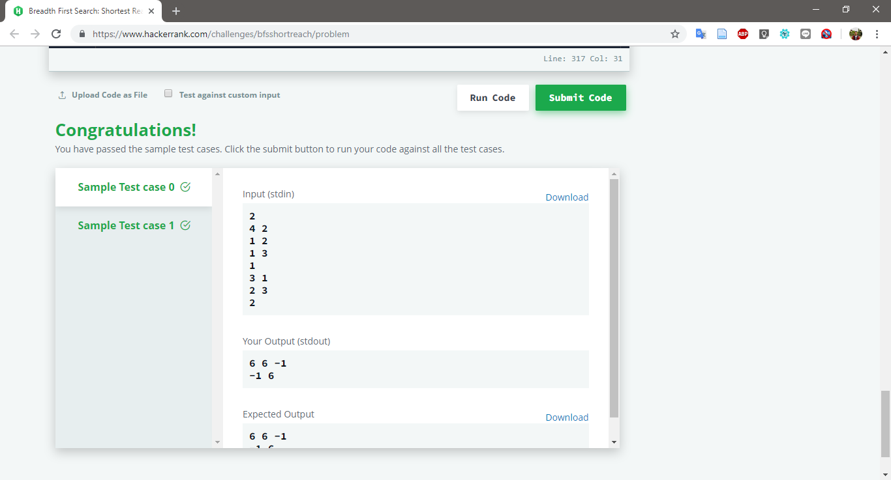

# Breadth First Search: Shortest Reach

Challenge at: https://www.hackerrank.com/challenges/bfsshortreach/problem
>Medium (Success Rate: 77.77%)

### Problem
<p>Find weight of each rutes from start node to all nodes. Weight @edge: 6. Unreacheble: -1</p>

#### Sample Input
``` 
2           // 2 Graph
4 2             // 4 Nodes; 2 Edges
1 2                 // edge(1,2)
1 3                 // edge(1,3)
1                   // Start Node
3 1             // 3 Nodes; 1 Edge
2 3                 // edge(2,3)
2                   // Start Node
```
#### Sample Output
```
6 6 -1
-1 6
```

#### Report:
Pass: 8/8




