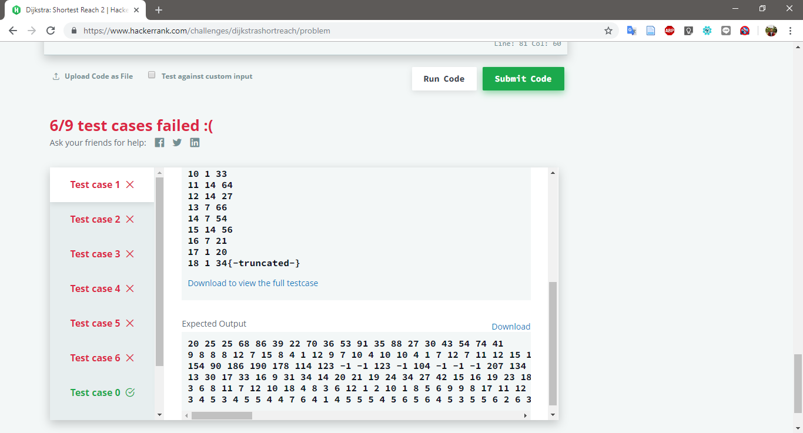
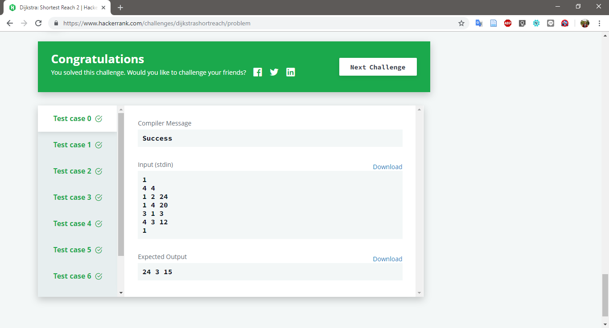

# Dijkstra: Shortest Reach 2

Challenge at: https://www.hackerrank.com/challenges/dijkstrashortreach/problem
>Hard (Success Rate: 57.90%)

### Problem
<p>Find shortest distance from start node <i>s</i> to all nodes.</p>

#### Sample Input
``` 
1           // 1 Test case
4 4             // 4 Nodes; 4 Edges
1 2 24              // edge(1,2) weight: 24
1 4 20              // edge(1,4) weight: 20
3 1 3               // edge(3,1) weight: 3
4 3 12              // edge(4,3) weight: 12
1               // Start Node: 1
```
#### Sample Output
```
24 3 15
```

#### Report:
1. Fail: 6/9
2. Pass: 9/9 -> Just `printf()` in the end of djikstra function




