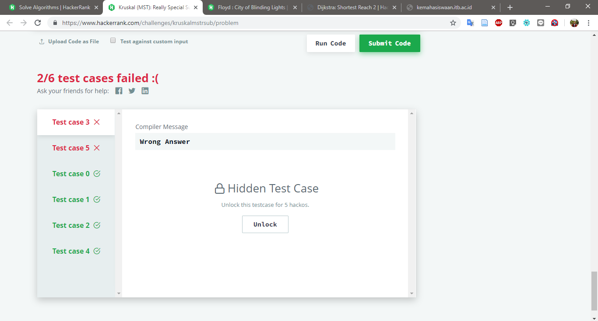
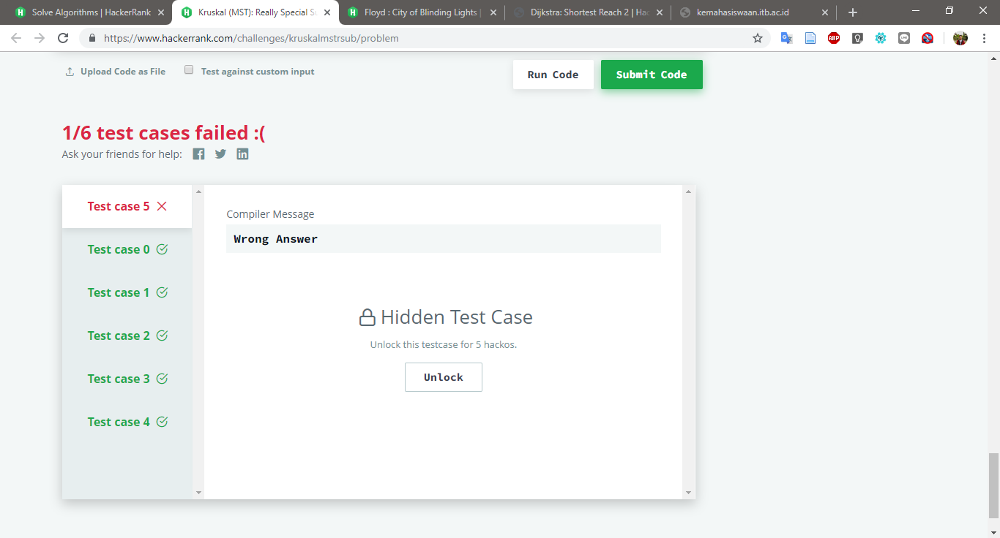
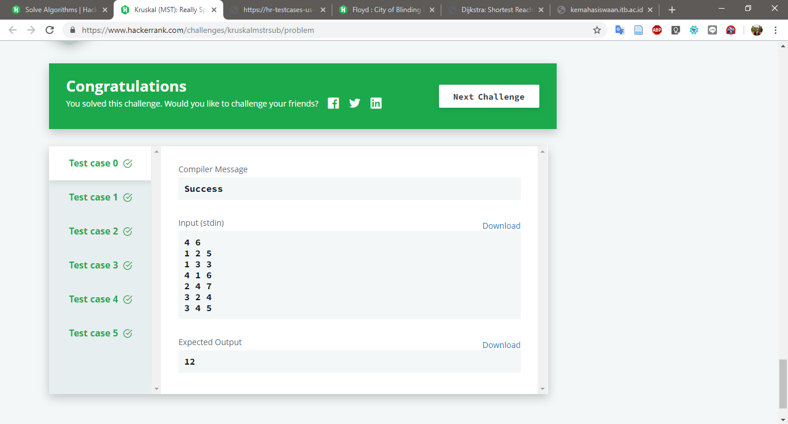

# Kruskal (MST): Really Special Subtree

Challenge at: https://www.hackerrank.com/challenges/kruskalmstrsub/problem
>Medium (Success Rate: 82.54%)

### Problem
<p>Find total weight MTS (Minimum Spaning Tree) using Kruskal Algorithm.</p>

#### Sample Input
``` 
4 6             // 4 Nodes; g Edges
1 2 5               // edge(2,3) weight: 5
1 3 3               // edge(1,3) weight: 3
4 1 6               // edge(4,1) weight: 6
2 4 7               // edge(2,4) weight: 7
3 2 4               // edge(3,2) weight: 4
3 4 5               // edge(3,4) weight: 5
```
#### Sample Output
```
12
```

#### Report:
1. Fail: 2/6
2. Fail: 1/6 -> Changing loop Algorithm for counting
3. Pass: 6/6 -> Edit MAXV for number of maximum Vertices from default code from book (1000 -> 10000)





