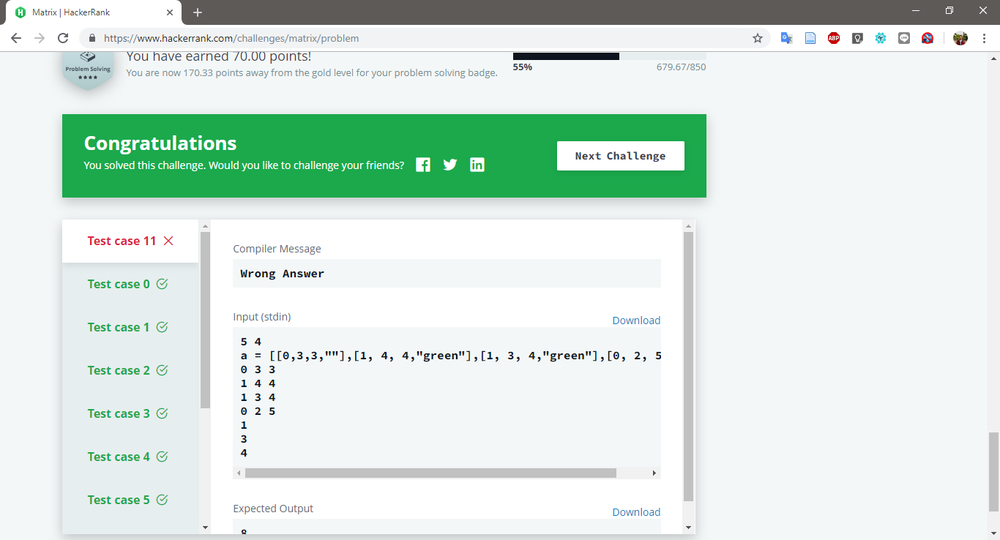

# Matrix

Challenge at : https://www.hackerrank.com/challenges/matrix/problem
>Hard (Success Rate: 60.92%)

### Problem
<p>The kingdom of Zion has cities connected by bidirectional roads. There is a unique path between any pair of cities. Morpheus has found out that the machines are planning to destroy the whole kingdom. If two machines can join forces, they will attack. Neo has to destroy roads connecting cities with machines in order to stop them from joining forces. There must not be any path connecting two machines.

Each of the roads takes an amount of time to destroy, and only one can be worked on at a time. Given a list of edges and times, determine the minimum time to stop the attack.</p>

#### Sample Input
```
5 3
2 1 8
1 0 5
2 4 5
1 3 4
2
4
0
```

#### Sample Output
```
10
```

### Report
1. Pass, but 10/11



#### Fail Test Case
```
5 4
a = [[0,3,3,""],[1, 4, 4,"green"],[1, 3, 4,"green"],[0, 2, 5,""]]
0 3 3
1 4 4
1 3 4
0 2 5
1
3
4
```
Failed because input Line 2.