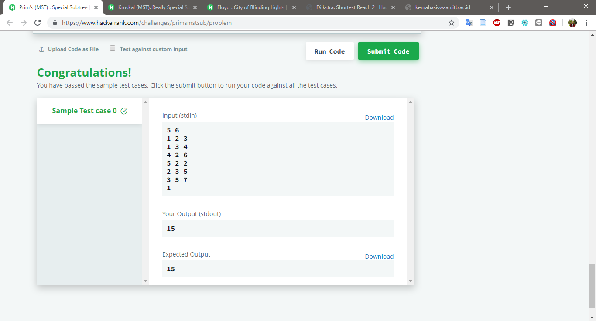
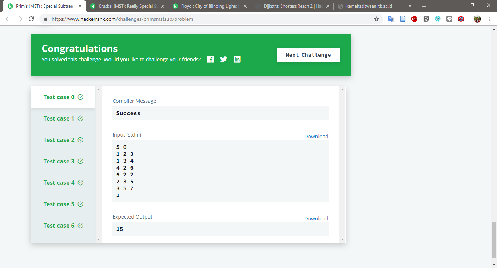

# Prim's (MST) : Special Subtree

Challenge at: https://www.hackerrank.com/challenges/primsmstsub/problem
>Medium (Success Rate: 82.04%)

### Problem
<p>Find total weight of MTS (Minimum Spaning Tree) using Prim's Algorithm. </p>

#### Sample Input
``` 
5 6             // 5 Nodes; 6 Edges
1 2 3               // edge (1,2) weight: 3
1 3 4               // ...
4 2 6               // ...
5 2 2               // ...
2 3 5               // ...
3 5 7               // ...
1                   // Start Node: 1
```
#### Sample Output
```
15
```

#### Report:
Pass: 7/7




