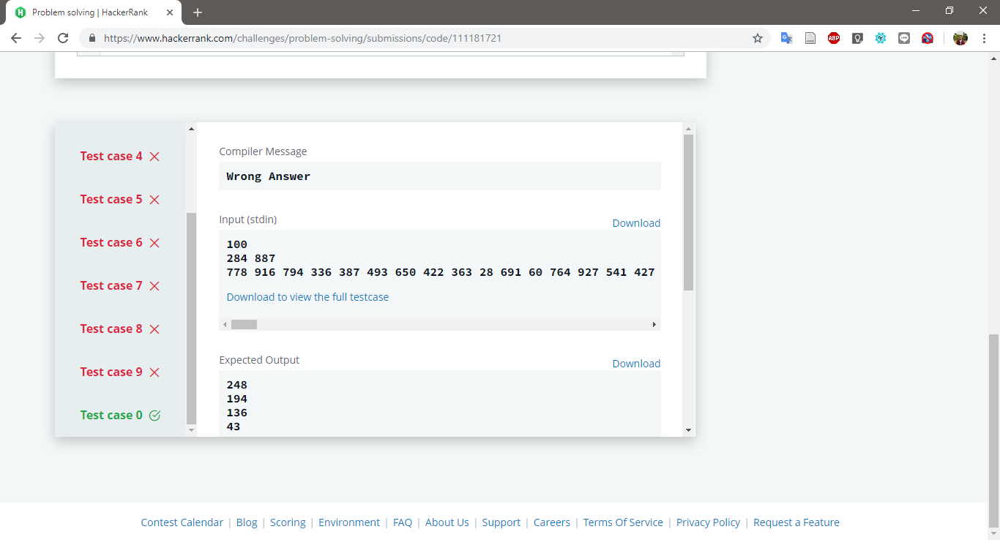
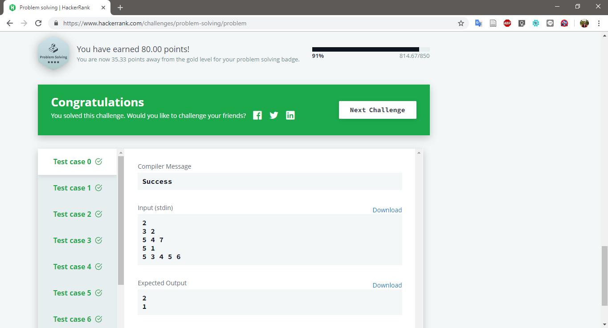

# Problem Solving

Challenge at : https://www.hackerrank.com/challenges/problem-solving/problem
>Hard (Success Rate: 39.53%)

### Problem
<p>There are N problems numbered 1..N which you need to complete. You've arranged the problems in increasing difficulty order, and the ith problem has estimated difficulty level i. You have also assigned a rating vi to each problem. Problems with similar vi values are similar in nature. On each day, you will choose a subset of the problems and solve them. You've decided that each subsequent problem solved on the day should be tougher than the previous problem you solved on that day. Also, to make it less boring, consecutive problems you solve should differ in their vi rating by at least K. What is the least number of days in which you can solve all problems?</p>

#### Sample Input
```
2
3 2
5 4 7
5 1
5 3 4 5 6
```

#### Sample Output
```
2
1
```

### Report
1. Failed
2. Pass



